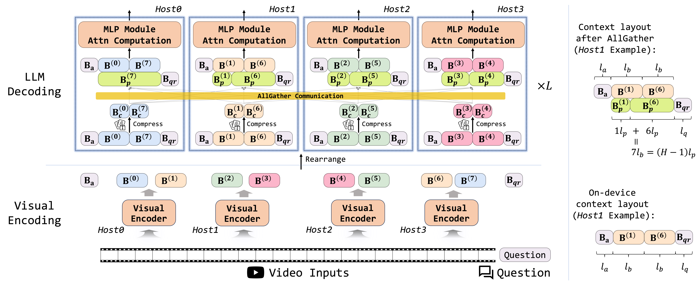

<div align="center">

<h1>APB & Spava: Running Approximate Attention across Multiple-GPUs</h1>

<p align="center">
<a href="https://huangyuxiang03.github.io/blogs_apb" target="_blank">Blog</a> |
<a href="https://huangyuxiang03.github.io/blogs_apb_zh" target="_blank">中文博客</a> |
<a href="https://aclanthology.org/2025.acl-long.525.pdf" target="_blank">APB Paper (ACL 2025)</a> |
<a href="TODO" target="_blank">Spava Paper (Arxiv)</a> 
</a>
 
</p>

**10x Lossless Long-Context Inference Speedup with Sequence Parallelism-Aware Approximate Attention**
</div>

APB is a distributed long-context inference framework that leverages multi-host approximate attention to enhance inference speed, achieving speedups of up to **9.2x**, **4.2x**, and **1.6x** compared to **Flash Attention**, **Ring Attention**, and **Star Attention**, respectively.

Spava is a sequence-parallelism-aware approximate attention framework designed to accelerate long-video understanding and tackle the wall-time burden in prefill, achieving speedups to **12.72x**, **1.70x**, and **1.18x** over FlashAttn, ZigZagRing, and APB, without notable performance loss.

##
<div align="center">
<h4>This project was made possible thanks to a collaboration with </h4>
</div>

##


## APB


APB applies a tailored appoximate attention mechanism to a sequence parallelism framework. The inference process of APB is listed below sequencially.

- Context Splitting: The input sequence is evenly split to each host and prepended with an anchor block. An anchor block is the starting positions of the input sequence. Notably, the anchor block we use in APB is smaller than Star Attention.
- Block Compression: Before the attention calculation, the KV cache of each block is compressed via [Locret](https://github.com/huangyuxiang03/Locret)'s retaining heads.
- Communication: The compressed context block is sent to every host. Then, we construct the passing block by concatenating the compressed context block sent by the previous hosts.
- Computation: The attention is calculated on the anchor block, the passing block, and the local context block. The passing block is discarded right after attention and does not participate subsequent calculations.


### Usage

#### Environment Setup

```
conda create -n apb python=3.9
conda activate apb
pip install -r requirements.txt 
pip install experiments_apb/flash-attention-apb
pip install experiments_apb/ring-flash-attention-main
```

#### Download Retaining Heads

|BackBone Model | HF Repo |
| - | - |
| Llama-3.1-8B-instruct | [Link](https://huggingface.co/thunlp/APB-Locret-llama-3.1-8B-instruct) |
| Qwen-2.5-14B-instruct | [Link](https://huggingface.co/thunlp/APB-Locret-qwen-2.5-14B-instruct) |
| Yi-34B-200K | [Link](https://huggingface.co/thunlp/APB-Locret-Yi-34B-200K/upload/main)|
| Llama-3-8B-1M-instruct | [Link](https://huggingface.co/thunlp/APB-Locret-llama-3-8B-1M-instruct)|

#### Example

We provide an example of using APB to process an NIAH-Simple-1-like query with 8 GPUs.

First, modify the model path, locret path, and the digits (the needle in NIAH tasks) in `example_apb/llama.sh`.

Then, run the following command.

```
bash example_apb/llama.sh
```

The output is expected as follows (if the digits are set to `688435772345`): 
```
Ground Truth: 688435772345
Prediction: 688435772345.
```

#### Reproduction Instructions

Please setup the environment first, then refer to `experiments_apb/README.md` for details.

## Spava

### Design



We extend the idea of accelerating long-context prefill via approximate attention on multiple GPUs to long-video understanding, and we improve APB from the following aspects:

- Training free: We find that identifying the essential KVs via query-aware selection is more efficient than training a retaining head in long-video understanding, due to the information redundancy in videos.
- Load balancing: APB suffers from imbalanced computation load across hosts. We construct a ZigZag style load balancing strategy to alleviate this problem.
- Communication-computation overlapping: Each physical host contains two virtual hosts. Communication of the second virtual host's passing block can be overlapped with the attention calculation of the first virtual host.
- Other optimizations that benefit both performance and efficiency.

### Usage 

#### Environment Setup

First, setup a conda environment by:
```
conda create -n spava python=3.9
conda activate spava
```
Install all the dependencies by:
```
pip install -r requirements_spava.txt
pip install flash_attn==2.6.3 --no-build-isolation
```
Install the `flash-attention-apb` and `ring-flash-attention`
```
cd dependencies_spava
pip install flash-attention-apb --no-build-isolation
pip install ring-flash-attention-main
cd ../
```

#### Setup Benchmark Data

Please follow the original repo of [LongVideoBench](https://github.com/longvideobench/LongVideoBench) and [VNBench](https://github.com/joez17/VideoNIAH) to download the data.

#### Reproducing Our Results


- LongVideoBench
```
cd experiments_spava/longvideobench
bash run.sh # detailed instructions on running the code are provided in run.sh
cd - 
```

- VNBench
```
cd experiments_spava/vnbench
bash run.sh # detailed instructions on running the code are provided in run.sh
cd -
```

- Speed Test
```
cd experiments_spava/speed_test
bash run.sh # detailed instructions on running the code are provided in run.sh
cd -
```


## Citation

Please cite our papers ([APB](https://aclanthology.org/2025.acl-long.525.pdf), [Spava](TODO)) if you find our work valuable.

```
@article{huang2025apb,
  title={APB: Accelerating Distributed Long-Context Inference by Passing Compressed Context Blocks across GPUs},
  author={Huang, Yuxiang and Li, Mingye and Han, Xu and Xiao, Chaojun and Zhao, Weilin and Sun, Ao and Zhou, Hao and Zhou, Jie and Liu, Zhiyuan and Sun, Maosong},
  journal={Proceedings of ACL},
  year={2025}
}

@article{huang2026spava,
  title={Spava: Accelerating Long-Video Understanding via Sequence-Parallelism-aware Approximate Attention},
  author={Huang, Yuxiang and Li, Mingye and Han, Xu and Xiao, Chaojun and Zhao, Weilin and Sun, Ao and Zhou, Hao and Meng, Fandong and Liu, Zhiyuan},
  journal={TODO},
  year={2026}
}
```

## Acknowledgement

The benchmark framework is partially adapted from [Star Attention](https://github.com/NVIDIA/Star-Attention), [MInference](https://github.com/microsoft/MInference), [RULER](https://github.com/NVIDIA/RULER), [InfiniteBench](https://github.com/OpenBMB/InfiniteBench), [LongVideoBench](https://github.com/longvideobench/LongVideoBench), and [VNBench](https://github.com/joez17/VideoNIAH). We deeply thank the authors of these code repos for their contribution to the long-context inference community.

