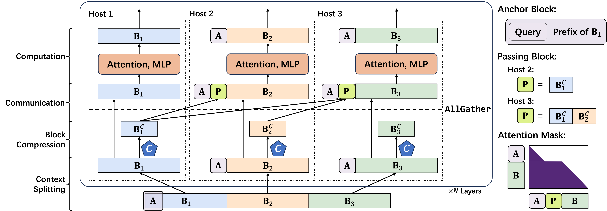

<div align="center">

<h1>APB: Accelerating Distributed Long-Context Inference by Passing Compressed Context Blocks across GPUs</h1>

**10x Lossless Long-Context Inference Speedup with Paralleled Approximate Attention. [[Paper]]()**
</div>

APB is a distributed long-context inference framework that leverages multi-host approximate attention to enhance inference speed, achieving speedups of up to **9.2x**, **4.2x**, and **1.6x** compared to **Flash Attention**, **Ring Attention**, and **Star Attention**, respectively.

##
<div align="center">
<h4>This project was made possible thanks to a collaboration with </h4>
</div>

##


## Design




APB applies a tailored appoximate attention mechanism to a sequence parallelism framework. The inference process of APB is listed below sequencially.

- Context Splitting: The input sequence is evenly split to each host and prepended with an anchor block. An anchor block is the starting positions of the input sequence. Notably, the anchor block we use in APB is smaller than Star Attention.
- Block Compression: Before the attention calculation, the KV cache of each block is compressed via [Locret](https://github.com/huangyuxiang03/Locret)'s retaining heads.
- Communication: The compressed context block is sent to every host. Then, we construct the passing block by concatenating the compressed context block sent by the previous hosts.
- Computation: The attention is calculated on the anchor block, the passing block, and the local context block. The passing block is discarded right after attention and does not participate subsequent calculations.


## Usage

### Environment Setup

```
conda create -n apb python=3.9
conda activate apb
pip install -r requirements.txt 
pip install experiments/flash-attention-apb
pip install experiments/ring-flash-attention-main
```

### Download Retaining Heads

|BackBone Model | HF Repo |
| - | - |
| Llama-3.1-8B-instruct | [Link](https://huggingface.co/hyx21/APB-Locret-llama-3.1-8B-instruct) |
| Qwen-2.5-14B-instruct | [Link](https://huggingface.co/hyx21/APB-Locret-qwen-2.5-14B-instruct) |
| Yi-34B-200K | [Link](https://huggingface.co/hyx21/APB-Locret-Yi-34B-200K/upload/main)|
| Llama-3-8B-1M-instruct | [Link](https://huggingface.co/hyx21/APB-Locret-llama-3-8B-1M-instruct)|

### Example

We provide an example of using APB to process an NIAH-Simple-1-like query with 8 GPUs.

First, modify the model path, locret path, and the digits (the needle in NIAH tasks) in `example/llama.sh`.

Then, run the following command.

```
bash example/llama.sh
```

The output is expected as follows (if the digits are set to `688435772345`): 
```
Ground Truth: 688435772345
Prediction: 688435772345.
```

### Reproduction Instructions

Please setup the environment first, then refer to `experiments/README.md` for details.


## Citation

Please cite our [paper](https://arxiv.org/abs/xxxx) if you find our work valuable.

```
@article{huang2025apb,
  title={APB: Accelerating Distributed Long-Context Inference by Passing Compressed Context Blocks across GPUs},
  author={Yuxiang Huang, Mingye Li, Xu Han, Chaojun Xiao, Weilin Zhao, Sun Ao, Jie Zhou, Hao Zhou, Zhiyuan Liu, Maosong Sun},
  journal={arXiv preprint arXiv:xxxx},
  year={2025}
}
```

## Acknowledgement

The benchmark framework is partially adapted from [Star Attention](https://github.com/NVIDIA/Star-Attention), [MInference](https://github.com/microsoft/MInference), [RULER](https://github.com/NVIDIA/RULER), and [InfiniteBench](https://github.com/OpenBMB/InfiniteBench). We deeply thank the authors of these code repo for their contribution to the long-context inference community.

